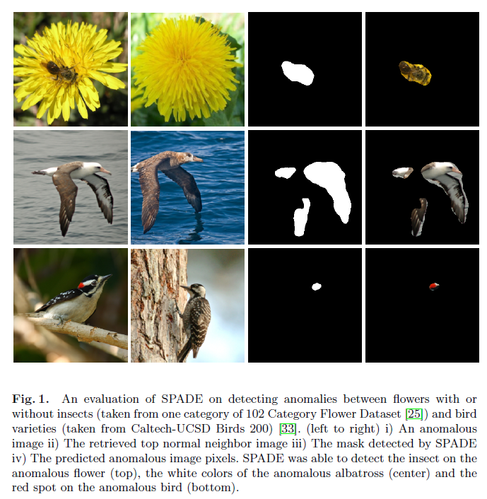
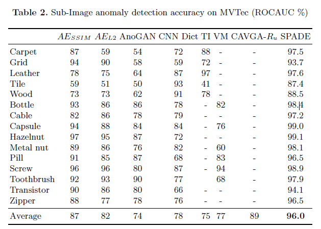
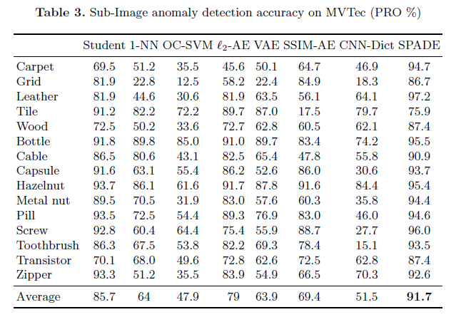
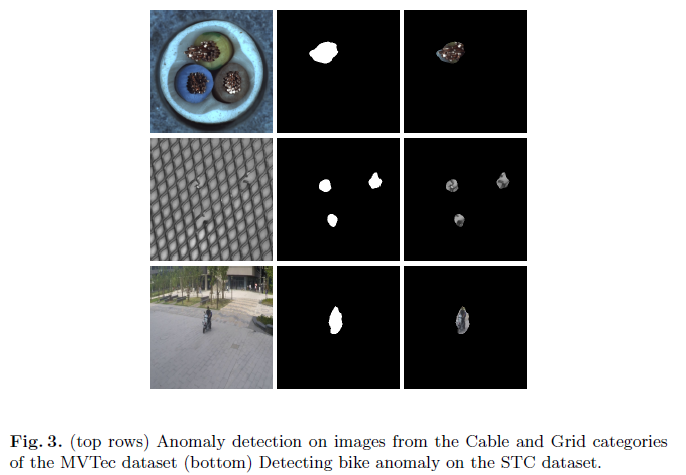
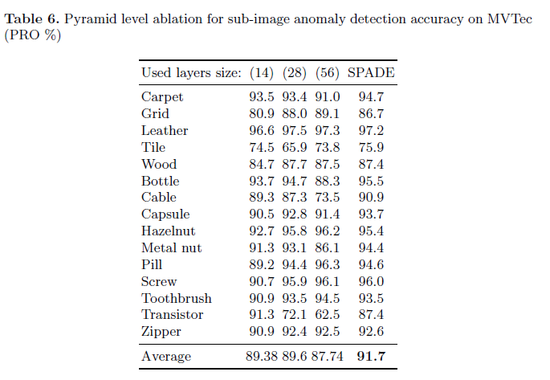
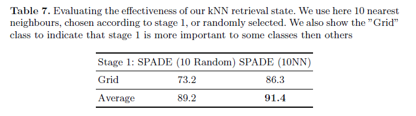

# Sub-Image Anomaly Detection with Deep Pyramid Correspondences

## 文献信息

| 信息           | 内容                                                         |
| -------------- | ------------------------------------------------------------ |
| 发布日期       | May. 2021                                                    |
| 作者           | Niv Cohen and Yedid Hoshen,                                  |
| 机构           | The Hebrew University of Jerusalem, Israel                   |
| 期刊与影响因子 | xxxx and x.x                                                 |
| 引用           | xxx                                                          |
| 链接           | [Sub-Image Anomaly Detection with Deep Pyramid Correspondences](http://arxiv.org/abs/2005.02357) |
| 代码           | [byungjae89 / SPADE-pytorch](https://github.com/byungjae89/SPADE-pytorch) |

## 个人理解

>- 问题：缺陷定位问题和样本未对齐问题；
>- 方法：（1）预训练网络提取特征（被证明优于正样本训练特征提取器）；（2）根据训练集的正样本特征库；（3）根据测试特征，找到K 个最近邻的所有像素位置构建了一个特征库；（4）计算测试提取的特征与特征库的平均距离，作为异常分数；（5）根据阈值，即0，判断该像素是否为异常（因为小于0表示不能在k个最邻近的正常图像中找到一个紧密对应的像素）。该方法的问题是KNN比较耗时，同时不一定能找到相似的像素位置；
>- 结论： MVTec数据集上达到SOTA；
>- 理解：特征库中每个样本都有一定的旋转位置信息，最邻近就是先去匹配一个角度，让样本先对齐，再用差分思想比较是否存在异常。
>- 优化：推荐PaDiM算法。

---

## Abstract

基于深度预训练特征的最近邻 (kNN) 方法在应用于整个图像时表现出非常强大的异常检测性能。 kNN 方法的一个限制是缺乏描述异常在图像内的位置的分割图。 在这项工作中，作者提出了一种基于异常图像和恒定数量的相似正常图像之间对齐的新型异常分割方法。 作者的方法，即语义金字塔异常检测 (SPADE)， 使用基于多分辨率特征金字塔的对应关系。 SPADE 被证明可以在无监督异常检测和定位方面实现最先进的性能，同时几乎不需要训练时间。

**关键词：**异常检测、最近邻、特征金字塔

## 1. Introduction

人类一生中会观察许多图像，其中大部分都没什么兴趣。 有时，会出现表示机会或危险的图像。 人类的一项关键能力是检测偏离先前模式的新图像，从而触发人类主体的特别警惕。 由于此功能的重要性，计算机检测异常是人工智能的一项关键任务。

作为一个激励示例，让大家考虑装配线故障检测的设置。装配线制造特定产品的许多实例。大部分产品正常且无故障。不幸的是，在个别情况下，制造的产品包含一些缺陷，例如凹痕、错误标签或零件重复。由于信誉良好的制造商努力保持产品质量的一致性，因此及时发现有缺陷的产品非常有价值。如前所述，人类非常擅长异常检测，但是有几个关键限制让人工操作员监督装配线制造的每个产品：i) 熟练人工操作员需要高工资 ；ii) 人类的注意力持续时间有限（ [14] 指出这可以低至 20 分钟！）；iii）人工操作员无法在不同的装配线之间复制； iv) 不同的操作员通常不会保持一致的质量水平。因此，异常检测需要计算机视觉解决方案。

尽管视觉异常检测非常有价值，但它也非常具有挑战性。所有异常检测方法的共同挑战之一是异常的意外性。通常在监督分类中，测试类来自与训练数据相似的分布。在大多数异常检测设置中，在训练期间不会观察到异常的分布。不同的异常检测方法因在训练时观察异常的方式而异。在本文中，作者处理在训练时仅观察到正常数据（但没有异常）的设置。这是一个实用的设置，因为获取正常数据（例如不包含故障的产品）通常很容易。此设置有时称为半监督 ([7])。由于此含义含糊不清，作者将此设置称为仅正常训练设置。一个更简单的场景是完全监督，即在训练期间，正常和异常示例都带有标签。由于此训练设置类似于标准的监督分类，这是一项具有有效解决方案的成熟任务，因此在本文工作中将不涉及。

视觉异常检测（而不是非图像异常检测方法）的另一个挑战是异常的定位，即分割算法认为异常的图像部分。 这对于算法决策的可解释性以及在运营商和新型 AI 系统之间建立信任非常重要。 这对于异常检测尤为重要，因为其目标是检测人类可能不熟悉的以前从未见过的新变化。 在这种情况下，计算机可能会教人类操作员新异常的存在，或者人类可能会决定不感兴趣的异常，因此不会拒绝产品，从而节省成本。

作者提出了一种解决子图像异常检测和分割任务的新方法。 作者的方法不需要扩展的训练阶段，它快速、稳健并达到了最先进的性能。 作者方法包括几个阶段：i）使用预训练的深度神经网络（例如ImageNet训练的ResNet）提取图像特征；ii）最近邻检索与目标最近的K个正常图像；iii）找到之间的密集像素级对应目标和正常图像，在检索到的正常图像中没有接近匹配的目标图像区域被标记为异常。 作者的方法在工业产品数据集（MVTech）以及校园环境（Shanghai Tech Campus).）中的监控数据集上进行了评估。 作者的方法在图像级和像素级异常检测方面都达到了最先进的性能。

## 2. Previous Work

作者概述了图像级和子图像异常检测方法。

**图像级方法**：作者回顾检测图像是否异常的方法，这些方法不是专门为分割图像中的异常而设计的。 图像级异常检测的方法主要分为三类：基于重建的、基于分布的和基于分类的。

**基于重建的方法**：在训练数据上学习一组基函数，并尝试使用这些基函数的稀疏集来重建测试图像。如果使用基函数不能完美地重建测试图像，则将其表示为异常，因为它很可能来自与正常训练数据不同的基。不同的方法在它们使用的一组基函数和损失函数方面有所不同。基函数的流行选择包括：K-means [15]、K 个最近邻 (kNN) [9]、主成分分析 (PCA) [20]。使用的损失函数在简单的向量度量（如欧几里得或 L1 损失）之间有所不同，并且可以使用更复杂的感知损失，如结构相似性（SSIM）[32]。最近，深度学习方法拓宽了基于重建方法的工具箱。主成分已扩展到自动编码器 [27] 学习的非线性函数，包括去噪和变分自动编码器 (VAE)。深度感知损失函数 [34] 显着改善了传统的感知损失函数。基于重建的损失函数的主要缺点是：i) 对用于评估重建质量的特定损失度量敏感，使其设计不明显并损害性能； ii) 确定正确的功能基础。

第二类方法是**基于分布的方法**：主要原理是对正态数据分布的概率密度函数（PDF）进行建模。测试样本使用PDF进行评估，具有低概率密度值的测试样本被指定为异常。不同的基于分布的方法因它们所做的分布假设、用于估计真实 PDF 的近似值以及训练程序而异。参数方法包括高斯或高斯混合 (GMM)。核密度估计 [21] 是一种值得注意的非参数方法。最近邻 [9] 也可以看作是分布的（因为它执行密度估计），但请注意，作者也将其指定为基于重建的方法。最近深度学习方法已经提高了性能，特别是通过将高维数据分布映射到较低和较密的空间。 PDF 估计在低维空间中通常更容易。学习深度投影和分布建模可以像[36]一样联合完成。最近的另一个发展，对抗性训练，也被应用于异常检测，例如 ADGAN [8]。尽管原则上分布方法非常有前途，但它们存在一些严重的缺点：i) 真实图像数据很少遵循简单的参数分布假设； ii) 非参数方法具有很高的样本复杂性并且通常需要大量的训练集实践。

最近，**基于分类的方法**在图像级异常检测方面取得了主导地位。一种范例是一类支持向量机（OC-SVM）[28]。其最成功的变体之一是支持向量数据描述（SVDD）[30]，它可以被视为寻找包含至少给定数据部分的最小球体。这些方法对使用的特征空间非常敏感，从而产生了用于学习特征的内核方法和深度方法 [26]。另一组方法基于自监督学习。 Golan 和 El-Yaniv [11] 提出了一种基于 RotNet 的 [10] 方法，该方法对输入数据执行几何变换并训练一个尝试识别所使用变换的网络。他们使用经过训练的分类器将很好地泛化到新的正常图像但不能泛化到异常图像的想法，从而允许将其用作异常检测标准。亨德里克斯等人。 [18] 改进了架构和训练程序，实现了强大的性能。 Bergman 和 Hoshen [4] 将这项工作与 SVDD 类型标准相结合，并将其扩展到非图像数据。最近伯格曼等人。 [3] 表明使用这种自监督方法学习的特征无法与基于 ImageNet 的通用特征提取器竞争。基于 kNN（或高效近似）的简单方法明显优于此类自监督方法。

**子图像方法**：前面描述的方法解决了将整个图像分类为正常或异常的任务，并且大多数技术不是特定于图像的。分割包含异常的特定像素的任务对于图像来说是特殊的，并且在深度学习社区中的关注度要低得多。Napoletano et al. [24] 从小的重叠块中提取深层特征，并使用基于 K-means 的分类器对降维特征进行分类。 Bergmann et al. [5] 在 MVTech nding 互补优势上评估了 ADGAN 和自动编码器方法。最近，Venkataramanan et al.[31] 使用了一种注意力引导的 VAE 方法，结合了多种方法（GAN 损失 [13]、GRADCAM [29]）。 Bergmann et al.[6] 使用基于学生-教师的自动编码器方法，采用预训练的 ImageNet 深度特征（仍然需要昂贵的训练阶段）。在这项工作中，作者提出了一种新的子图像对齐方法，它比以前的方法更准确、更快、更稳定，并且不需要专门的训练阶段。为了支持子图像异常检测的研究，引入了用于评估此任务的高质量数据集，例如：MVTech [5] - 模拟工业故障检测的数据集，其目标是检测包含故障的产品图像部分例如凹痕或零件缺失。 ShanghaiTech Campus dataset [23] - 一个模拟监控环境的数据集，其中摄像机观察繁忙的校园，目的是检测异常物体和活动，例如 ghts。Hendrycks et al.[17] 还提出了一个新的数据集，其中包含道路危险等异常情况。作者在两个最常用的数据集 MVTech 和 ShanghaiTech Campus (STC) 上评估他们的工作。

## 3. Correspondence-based Sub-Image Anomaly Detection

作者提出了他们的子图像异常检测方法。 作者的方法由几个部分组成：i) 图像特征提取； ii) K 最近邻正常图像检索； iii) 像素对齐与深度特征金字塔对应。

### 3.1 Feature Extraction

作者方法的第一阶段是提取强大的图像级特征，该特征可用于像素级图像对齐。 提取特征有多种选择， 最常用的选项是自监督特征学习，即直接在输入的正常图像上从头开始学习特征。 尽管这是一个有吸引力的选择，但在小型训练数据集上学习的特征确实足以作为高质量的相似性度量，这一点并不明显。 Bergman et al.[4]进行的分析说明自监督特征在异常检测方面的表现不如 ImageNet 训练的 ResNet 特征。 因此，作者使用了在 ImageNet 数据集上预训练的 ResNet 特征提取器。 作为图像级特征，作者使用全局池化最后一个卷积层后获得的特征向量。 让他们表示全局特征提取器 $F$，对于给定的图像 $x_i$，作者定义提取的特征$ f_i$：
$$
f_{i} = F (x_{ i })
$$
在初始化时，计算并存储所有训练图像（都是正常的）的特征。 在推理时，仅提取目标图像的特征。

### 3.2 K Nearest Neighbor Normal Image Retrieval

作者方法的第一阶段是**使用 DN2 [4] 确定哪些图像包含异常**。 对于给定的测试图像 y，作者从训练集 $N_k (f_y) $中检索与它最近的 K 个正常图像。 使用图像级特征表示之间的欧几里德度量来测量距离。
$$
d(y) = \frac{1}{K}\sum_{f \in N_K (f_y)} \Vert f-f_y \Vert ^2
$$
图像在此阶段被标记为正常或异常。 通过验证 kNN 距离是否大于阈值来确定正分类。 预计大多数图像是正常的，只有少数图像被指定为异常。

### 3.3 Sub-image Anomaly Detection via Image Alignment

在图像级阶段被标记为异常后，目标是定位和分割一个或多个异常的像素。 如果图像被错误地归类为异常，我们的目标是不将任何像素标记为异常。

作为一个动机，让作者考虑将测试图像与检索到的正常图像对齐。 通过找出测试图像和正常图像之间的差异，作者希望能够检测到异常像素。 这种朴素的方法有几个问题 i) 假设对象可能包含多个正常部分，与特定的正常图像对齐可能会失败； ii) 对于小数据集或经历复杂变化的对象，作者实际上可能永远不会找到正常的训练在各个方面都与测试图像相似的图像，会触发误报检测； iii) 计算图像差异将对所使用的损失函数非常敏感。

为了克服上述问题，作者提出了一种多图像对应方法。 作者使用相关测试和正常训练图像的特征提取$F(x_i,p)$ 在每个像素位置 $p \in P$处提取深度特征。 特征提取器的细节将在3.4第二节中描述。作者在 K 个最近邻的所有像素位置构建了一个特征库 $G={F(x_1,p)|p \in P} \cup {F(x_2,p)|p \in P} .. \cup {F(x_K,p)|p \in P} $。 像素 p 处的异常分数由特征 $F (y,p) $与其距离特征图库 G 的最近特征之间的平均距离给出。 因此，目标图像 $y$ 中像素 $p$ 的异常分数由下式给出：
$$
d(y, p) = \frac{1}{k} \sum_{f \in N_k(F(y,[]))} \Vert f -F(y,p)\Vert ^2
$$
对于给定的阈值，如果 $d(y, p)>\theta$，即如果我们不能在 K 个最近邻的正常图像中找到一个紧密对应的像素，则该像素被确定为异常。

### 3.4 Feature Pyramid Matching

**密集对应对齐**是一种确定图像中正常部分或异常那部分的有效方法。为了有效地执行对齐，有必要确定匹配的特征。与前一阶段一样，作者的方法使用来自预先训练的深度 ResNet CNN 的特征。 ResNet 产生了一个金字塔特征。与图像金字塔类似，较早的层（级别）导致编码较少上下文的更高分辨率特征。后面的层编码较低分辨率的特征，这些特征编码更多的上下文，但空间分辨率较低。为了执行有效对齐，作者使用来自特征金字塔不同级别的特征来描述每个位置。具体来说，作者从最后 $M$ 个块的输出中连接特征，不同数量的 $M$ 的结果显示在实验部分。作者的特征对细粒度的局部特征和全局上下文进行编码，这使我们能够找到目标图像和 $K \ge 1$ 个正常图像之间的对应关系，而不是必须明确对齐图像，这在技术上更具挑战性和脆弱性。作者的方法可扩展且易于在实践中部署。作者将在 Sec 4. 中展示，他们的方法实现了最先进的子图像异常分割精度。

### 3.5 Implementation Details

在所有实验中，作者使用了一个 Wide-ResNet50x2 特征提取器，它在 ImageNet 上进行了预训练。 MVTec 图像大小调整为 256x256 并裁剪为 224x224。STC 图像大小调整为 256 256。由于 STC 数据集较大，我们将其训练数据二次采样到大约 5000 张图像。 为了与 [31] 进行比较，作者对 STC 测试集进行了 5 倍的二次采样。所有指标均以 256x256 图像分辨率计算，并且我们在需要时使用 cv2.INTERAREA 来调整大小。 除非另有说明，我们在第一个块 (56x56)、第二个块 (28x28) 和第三个块 (14x14) 的末尾使用了来自 ResNet 的特征，所有这些都具有相同的权重。 我们在 MVTtec 实验中使用了 $K=50$ 个最近邻，在 STC 实验中使用了 $K=1 $个最近邻（由于运行时的考虑）。 在所有实验中，作者使用$K=1$。

在获得每个图像的像素级异常分数后，作者使用高斯滤波器 ($\sigma= 4$​) 平滑结果。

## 4. Experiments

我们针对子图像异常检测中的最新技术对我们的方法进行了广泛的评估。

### 4.1 MVTec

为了模拟工业环境中的异常检测， Bregmann et al[5]提出了一个由 15 个不同类别的图像组成的数据集。 5 类包括纹理，如木材或皮革。 其他 10 个类包含对象（大部分是刚性的）。 对于每个类，训练集由正常图像组成。 测试集由正常图像以及包含不同类型异常的图像组成。 因此，该数据集遵循标准协议，在训练中不使用异常图像。 该数据集中的异常比文献中通常使用的异常更加模糊，例如在 CIFAR10 评估中，其中异常图像来自完全不同的图像类别。 相反，异常表现为轻微划伤的榛子或轻微弯曲的电缆。 由于异常处于子图像级别，即仅影响图像的一部分，数据集提供了指示异常区域精确像素位置的分割图。

作者的方法在 MVTec 数据集上的操作示例可以在图 2 中观察到，异常物体（榛子）有划痕，检索到的最近邻法线图像，包含一个完整的螺母，没有划痕。 通过搜索两幅图像之间的对应关系，作者的方法能够找到正常图像区域的对应关系，但不能找到异常区域的对应关系。 这导致对图像异常区域的准确检测。 异常图像像素显示在最右侧的图像上。

作者将他们的方法与过去几个月引入的几种方法以及长期存在的基线（如 OCSVM 和最邻近）进行了比较。 对于每个设置，作者都比较了方法被公开的合适指标。

作者首先比较深度最近邻匹配的质量作为发现异常图像的一种手段。 这是通过测试图像和最近邻的正常图像之间的距离计算的。 更大的距离表示更多的异常图像。 作者比较了他们方法的第一步的 ROC 曲线下面积 (ROCAUC) 和其他最先进的图像级异常检测方法。 请注意，作者方法的第一阶段与 DN2 [3] 相同。 这种比较很重要，因为它可以验证深度最近邻是否对这些数据集有效。 比较显示在表中。 1. 作者的方法被证明优于使用一系列自监督异常检测学习技术的一系列最先进的方法。 这证明了在 ImageNet（与 ImageNet 数据集非常不同）上训练的深度特征即使在与 ImageNet 非常不同的数据集上也非常有效

作者继续在像素级异常检测任务上评估他们的方法。这里的目标是分割包含异常的特定像素。作者使用两个既定指标评估他们的的方法。第一个是逐像素 ROCAUC，该度量是通过按每个像素到其 K 个最近对应点的距离对每个像素进行评分来计算的。通过扫描阈值范围，我们可以计算像素级 ROCAUC 曲线。异常类别被指定为阳性。之前的几项工作指出，ROCAUC 偏向于大型异常。为了减少这种偏差，Bergmann et al.[6] 提出了 PRO（每区域重叠）曲线度量。他们首先将异常掩码分成它们的连接组件，因此将它们划分为单独的异常区域。通过改变检测阈值，他们扫描误报率 (FPR)，对于每个 FPR，他们计算 PRO，即每个区域的像素被检测为异常的比例。此 FPR 的 PRO 分数是所有区域的平均覆盖率。 PRO 曲线度量计算 FPR 速率从 0 到0:3。PRO 分数是该积分的归一化值。

在表2中，作者将他们的逐像素 ROCAUC 度量方法与 Bergmann  et al.[5] 报告的最新结果进行比较以及 Venkataramanan et al. [31]的新结果。 大多数方法使用不同种类的自编码器，包括性能最佳的 CAVGA-Ru。 作者的方法明显优于所有方法。 这证明了作者基于金字塔的通信方法的优势。

在表3中，作者在PRO方面比较他们的方法。 如上所述，这是另一种每像素精度度量，它为覆盖很少像素的异常赋予更大的权重。 他们的方法与 Bregmann et al. [6]的基于预训练特征的方法的自动编码器进行了比较以及他们论文中提出的基线。 作者的方法比所有以前的方法取得了明显更好的结果。 作者注意到 Bregmann et al.还提出了一种具有更好结果的集成方法。 虽然作者的方法不使用集成（这也可能会改进我们的方法），但作者的性能也优于集成方法。 作者在图 2 中展示了他们方法的更多定性结果。 图 1 表明他们的方法能够恢复异常区域的准确掩码。

### 4.2 Shanghai Tech Campus Dataset

作者在上海科技园区数据集上评估他们的方法。 它模拟监控设置，其中输入由监控摄像机拍摄的视频组成，这些视频观察繁忙的校园。 该数据集包含 12 个场景，每个场景由训练视频和较少数量的测试图像组成。 训练视频不包含异常，而测试视频包含正常和异常图像。 异常被定义为行人进行非标准活动（例如 ghting）以及任何非行人的移动物体（例如摩托车）。

作者首先评估了针对其他最先进方法检测图像级异常的第一阶段。 作者在表4中显示，表明我们的第一阶段具有与最佳性能方法相当的性能 [19]。 更有趣的是，作者在表5中进行了比较像素级 ROCAUC 性能与最佳报告方法 CAVGA-Ru [31]。 作者的方法显着优于最佳报告方法。 请注意，作者与未使用异常监督的最佳方法进行了比较，因为作者不使用它并且异常监督在实践中通常不可用。

### 4.3 Ablation Study

作者对作者的方法进行了消融研究，以了解其不同部分的相对性能。 在表6中，作者使用不同级别的特征金字塔进行比较。作者经历过，使用太高的分辨率（56x56）的激活会显着损害性能（由于上下文有限），而使用更高的级别会导致性能下降（由于降低分辨率）。 使用金字塔中所有特征的组合会产生最佳性能。 在表 7 中，作者使用第一阶段执行的前 K 个相邻正常图像与第一阶段进行比较。 从数据集中随机选择它们。 作者观察到选择 kNN 图像可以提高性能。 这并不会平等地影响所有类。 例如，作者报告“网格”类的数字，该类在图像之间有很大差异。 对于这个类别，使用 kNN 图像比随机选择 K 个图像产生更好的性能。

## 5. Discussion

**对齐进行异常检测**：当前大多数子图像异常检测方法采用学习用于自动编码图像的大参数函数的方法，假设异常区域不会被很好地重建。 尽管这种方法确实取得了一些成功，但作者采用了更简单的方法。 与图像对齐方法类似，与其他子图像异常检测方法不同，作者的方法不需要特征训练，可以处理非常小的数据集。 作者的方法和标准图像对齐之间的区别在于，作者发现目标图像和 K 个正常图像的部分之间的对应关系，而不是简单对齐方法中的整个单个正常图像。 与对齐方法的联系可以帮助加速作者的方法，例如将其与 PatchMatch [2] 方法结合使用，该方法使用局部性来显着加速 kNN 搜索。

**上下文在异常检测中的作用**：异常图像和检索到的正常图像之间的对齐质量受到提取特征质量的强烈影响。 与处理检测和分割的其他工作类似，上下文非常重要。 需要局部上下文来实现具有高像素分辨率的分割图。 这些特征通常存在于深度神经网络的浅层中。 如果不了解全局上下文，即对象内部件的位置，局部上下文通常不足以进行对齐。 全局上下文通常位于神经网络的最深层，但全局上下文特征的分辨率较低。 来自不同级别的特征组合允许全局上下文和局部分辨率提供高质量的对应关系。 这个想法与特征金字塔网络 [22] 中的想法非常相似。

**优化运行时性能：**作者的方法严重依赖于 K 最近邻算法。 kNN 的复杂性与用于搜索的数据集的大小成线性比例，当数据集非常大或具有高维数时，这可能是一个问题。作者的方法旨在减轻复杂性问题。首先，作者在 2048 维向量的全局池化特征上计算初始图像级异常分类。对于中等大小的数据集，可以非常快速地实现这种 kNN 计算，并且可以将不同的加速技术（例如 KDTrees）用于大规模数据集。异常分割阶段需要像素级 kNN 计算，这明显比图像级 kNN 慢。然而，我们的方法将子图像 kNN 搜索限制为仅异常图像的 K 个最近邻，从而显着限制了计算时间。作者假设绝大多数图像是正常的，因此只有一小部分图像需要下一阶段的异常分割。此外，异常分割阶段是可解释性和与人类操作员建立信任所必需的，但在许多情况下，它不是时间关键的，因此对计算时间的要求更宽松。因此，从复杂性和运行时的角度来看，我们的方法非常适合实际部署。

**预训练对比学习特征**：以前的子图像异常检测方法要么使用自学习特征，要么使用自学习和预训练图像特征的组合。在这种情况下，自学方法通常训练自编码器并使用其重构误差进行异常检测。其他方法结合了预训练和自学方法，例如使用感知损失的方法和使用预训练编码器的 [6]。作者的数值结果表明，我们的方法明显优于此类方法。作者认为，鉴于这项工作中解决的仅正常训练集中的监督有限和数据集较小，很难击败非常深的预训练网络。因此，我们使用预先训练的特征并且不尝试修改它们。我们的方法取得的强大结果证明了这种方法的有效性。作者相信未来的工作应该集中在为这个特定任务调整深度预训练特征的方法上，并期望它比我们的方法有所改进。尽管我们的方法易于部署和通用，但在许多实际环境中应该使其成为一个不错的选择。

## 6. Conclusion

作者提出了一种新的基于对齐的方法来检测和分割图像内的异常。 作者的方法依赖于由预先训练的深度特征提取的像素级特征金字塔的 K 个最近邻。 我们的方法由两个阶段组成，旨在实现高精度和合理的计算复杂度。 我们的方法在两个真实的子图像异常检测数据集上表现优于当前最强的方法，同时更简单。 作者的方法易于部署，应该使其成为从业者的理想选择。

## 7. Acknowledgements

这项工作得到了 Federmann Cyber Security Research 的部分支持中心与the Israel National Cyber  Directorate合作。

## References

1.Akcay, S., Atapour-Abarghouei, A., Breckon, T.P.: Ganomaly: Semi-supervised anomaly detection via adversarial training. In: ACCV (2018) 
2.Barnes, C., Shechtman, E., Finkelstein, A., Goldman, D.B.: Patchmatch: A randomized correspondence algorithm for structural image editing. In: ACM ToG (2009) 
3.Bergman, L., Cohen, N., Hoshen, Y.: Deep nearest neighbor anomaly detection. arXiv preprint arXiv:2002.10445 (2020) 
4.Bergman, l., Hoshen, Y.: Classication-based anomaly detection for general data. In: ICLR (2020) 
5.Bergmann, P., Fauser, M., Sattlegger, D., Steger, C.: Mvtec ad{a comprehensive real-world dataset for unsupervised anomaly detection. In: CVPR (2019) 
6.Bergmann, P., Fauser, M., Sattlegger, D., Steger, C.: Uninformed students: Student-teacher anomaly detection with discriminative latent embeddings. arXiv preprint arXiv:1911.02357 (2019) 
7.Chandola, V., Banerjee, A., Kumar, V.: Anomaly detection: A survey. ACM computing surveys (CSUR) (2009) 
8.Deecke, L., Vandermeulen, R., Ru, L., Mandt, S., Kloft, M.: Anomaly detection with generative adversarial networks. In: ICLR (2018) 
9.Eskin, E., Arnold, A., Prerau, M., Portnoy, L., Stolfo, S.: A geometric framework for unsupervised anomaly detection. In: Applications of data mining in computer security (2002) 
10.Gidaris, S., Singh, P., Komodakis, N.: Unsupervised representation learning by predicting image rotations. ICLR (2018)
11.Golan, I., El-Yaniv, R.: Deep anomaly detection using geometric transformations. In: NeurIPS (2018) 
12.Gong, D., Liu, L., Le, V., Saha, B., Mansour, M.R., Venkatesh, S., Hengel, A.v.d.: Memorizing normality to detect anomaly: Memory-augmented deep autoencoder for unsupervised anomaly detection. In: ICCV (2019) 
13.Goodfellow, I., Pouget-Abadie, J., Mirza, M., Xu, B., Warde-Farley, D., Ozair, S., Courville, A., Bengio, Y.: Generative adversarial nets. In: NIPS (2014) 
14.Green, M.W.: The appropriate and eective use of security technologies in US schools: A guide for schools and law enforcement agencies. US Department of Justice, Oce of Justice Programs, National Institute of . . . (1999) 
15.Hartigan, J.A., Wong, M.A.: Algorithm as 136: A k-means clustering algorithm. Journal of the Royal Statistical Society. Series C (Applied Statistics) (1979) 
16.Hasan, M., Choi, J., Neumann, J., Roy-Chowdhury, A.K., Davis, L.S.: Learning temporal regularity in video sequences. In: CVPR (2016) 
17.Hendrycks, D., Basart, S., Mazeika, M., Mostajabi, M., Steinhardt, J., Song, D.: A benchmark for anomaly segmentation. arXiv preprint arXiv:1911.11132 (2019) 
18.Hendrycks, D., Mazeika, M., Dietterich, T.G.: Deep anomaly detection with outlier exposure. arXiv preprint arXiv:1812.04606 (2018) 
19.Huang, C., Cao, J., Ye, F., Li, M., Zhang, Y., Lu, C.: Inverse-transform autoencoder for anomaly detection. arXiv preprint arXiv:1911.10676 (2019) 
20.Jollie, I.: Principal component analysis. Springer (2011)
21.Latecki, L.J., Lazarevic, A., Pokrajac, D.: Outlier detection with kernel density functions. In: International Workshop on Machine Learning and Data Mining in Pattern Recognition (2007)
22.Lin, T.Y., Dollar, P., Girshick, R., He, K., Hariharan, B., Belongie, S.: Feature pyramid networks for object detection. In: CVPR (2017) 
23.Luo, W., Liu, W., Gao, S.: A revisit of sparse coding based anomaly detection in stacked rnn framework. In: ICCV (2017) 
24.Napoletano, P., Piccoli, F., Schettini, R.: Anomaly detection in nanobrous materials by cnn-based self-similarity. Sensors (2018) 
25.Nilsback, M.E., Zisserman, A.: Automated  ower classication over a large number of classes. In: 2008 Sixth Indian Conference on Computer Vision, Graphics & Image Processing (2008) 
26.Ru, L., Gornitz, N., Deecke, L., Siddiqui, S.A., Vandermeulen, R., Binder, A., Muller, E., Kloft, M.: Deep one-class classication. In: ICML (2018) 
27.Sakurada, M., Yairi, T.: Anomaly detection using autoencoders with nonlinear dimensionality reduction. In: MLSD (2014) 
28.Scholkopf, B., Williamson, R.C., Smola, A.J., Shawe-Taylor, J., Platt, J.C.: Support vector method for novelty detection. In: NIPS (2000) 
29.Selvaraju, R.R., Cogswell, M., Das, A., Vedantam, R., Parikh, D., Batra, D.: Gradcam: Visual explanations from deep networks via gradient-based localization. In: ICCV (2017) 
30.Tax, D.M., Duin, R.P.: Support vector data description. Machine learning (2004)
31.Venkataramanan, S., Peng, K.C., Singh, R.V., Mahalanobis, A.: Attention guided anomaly detection and localization in images. arXiv preprint arXiv:1911.08616 (2019) 
32.Wang, Z., Bovik, A.C., Sheikh, H.R., Simoncelli, E.P.: Image quality assessment: from error visibility to structural similarity. TIP (2004) 
33.Welinder, P., Branson, S., Mita, T., Wah, C., Schro, F., Belongie, S., Perona, P.: Caltech-ucsd birds 200 (2010) 
34.Zhang, R., Isola, P., Efros, A.A.: Colorful image colorization. In: ECCV (2016) 
35.Zhao, Y., Deng, B., Shen, C., Liu, Y., Lu, H., Hua, X.S.: Spatio-temporal autoencoder for video anomaly detection. In: Proceedings of the 25th ACM international conference on Multimedia (2017) 
36.Zong, B., Song, Q., Min, M.R., Cheng, W., Lumezanu, C., Cho, D., Chen, H.: Deep autoencoding gaussian mixture model for unsupervised anomaly detection. ICLR (2018)
