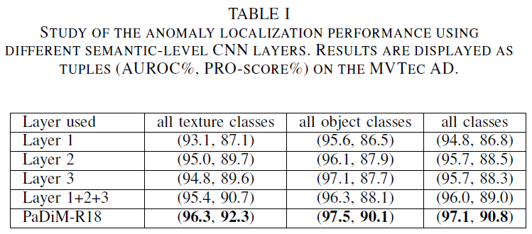
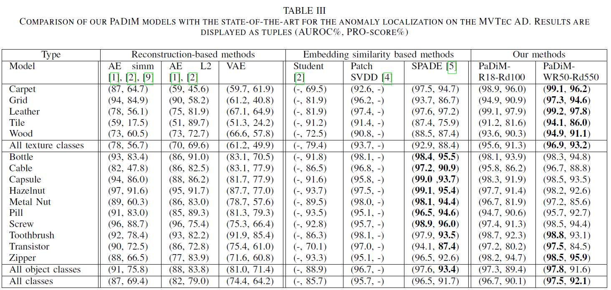
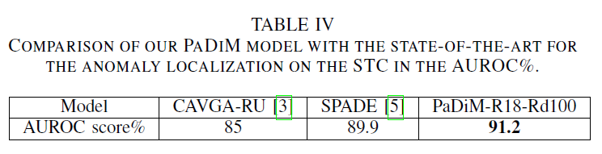
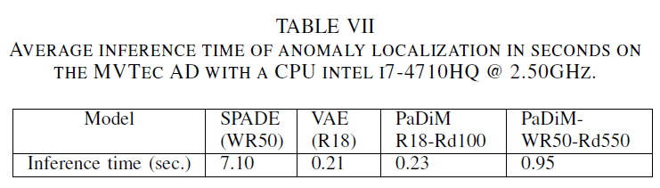
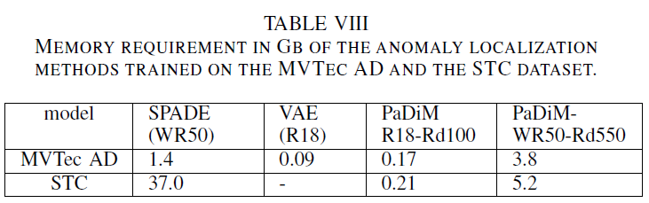

# PsaDiM: a Patch Distribution Modeling Framework for Anomaly Detection and Localization

## 文献信息
| 信息           | 内容                                                         |
| -------------- | ------------------------------------------------------------ |
| 发布日期       | Tue, 17 Nov 2020 17:29:18 UTC                                |
| 作者           | [Thomas Defard](https://arxiv.org/search/cs?searchtype=author&query=Defard%2C+T), [Aleksandr Setkov](https://arxiv.org/search/cs?searchtype=author&query=Setkov%2C+A), [Angelique Loesch](https://arxiv.org/search/cs?searchtype=author&query=Loesch%2C+A), [Romaric Audigier](https://arxiv.org/search/cs?searchtype=author&query=Audigier%2C+R) |
| 机构           | Universite Paris-Saclay                                      |
| 期刊与影响因子 | ICPR 2020                                                    |
| 引用数量       | 30                                                           |
| 链接           | [PaDiM: a Patch Distribution Modeling Framework for Anomaly Detection and Localization](https://arxiv.org/abs/2011.08785) |
| 代码           | [xiahaifeng1995/PaDiM-Anomaly-Detection-Localization](https://github.com/xiahaifeng1995/PaDiM-Anomaly-Detection-Localization-master) |

## 个人理解
>
>- 问题：（1）深度神经网络训练麻烦；（2）K-最近邻 (K-NN) 算法等后处理耗时。
>- 方法：PaDiM，（Patch Distribution Modeling），（1）利用预训练卷积网络去提取**基于块的嵌入向量（Patch embedding）**；（3）还利用**不同CNN语义信息层的相关性**去更好地定位异常；（3）多元高斯分布去计算正常类别的**概率表征（probabilistic representation）**。该方法的缺点是需要样本对齐，因为均值和方差会消除角度旋转干扰，当测试样本旋转角度过大，会一直被检测为NG。                                                                                                                                                                                                                            
>- 结果：在MVTec AD 和STC datasets 达到SOTA。同时，还扩展评估协议去验证非对齐（non-aligned）数据集效果。
>- 个人理解：对多个正常样本求均值和方差，构建一个正样本分布。而当一个新样本，不符合该分布时表示异常。
>- 优化：根据代码[PaDiM-Anomaly-Detection-Localization](https://github.com/xiahaifeng1995/PaDiM-Anomaly-Detection-Localization-master)，1、特征提取inference只需要到前三层，节省推理时间；2、保存方差的逆且利用多线程计算，节省马氏距离计算时间, [[link]](https://github.com/xiahaifeng1995/PaDiM-Anomaly-Detection-Localization-master/issues/8)；3、EfficientNet骨干网络，[[link]](https://github.com/ingbeeedd/PaDiM-EfficientNet)；4、因为特征会随机降维选取，特征选择位置也需要保存，利于后续推理；5、PRO Score得分。
---


## Abstract

作者提出了一种新的块分布建模框架 PaDiM，以在一类学习环境中同时检测和定位图像中的异常。 PaDiM 使用预训练的卷积神经网络 (CNN) 进行块嵌入，并使用多元高斯分布来获得正常类的概率表示。 它还利用 CNN 不同语义级别之间的相关性来更好地定位异常。 PaDiM 在 MVTec AD 和 STC 数据集上的异常检测和定位都优于当前最先进的方法。 为了匹配现实世界的视觉工业检测，作者扩展了评估协议以评估异常定位算法在非对齐数据集上的性能。 PaDiM 最先进的性能和低复杂性使其成为许多工业应用的理想选择。

## I. INTRODUCTION

人类能够在一组同质的自然图像中检测到异质或意外的模式。这项任务被称为异常或新奇检测，具有大量应用，其中包括视觉工业检测。然而，异常是生产线上非常罕见的事件，手动检测很麻烦。因此，异常检测自动化将通过避免注意力持续时间缩短和促进人工操作员的工作来实现持续的质量控制。在本文中，作者专注于异常检测，特别是异常定位，主要是在工业检测环境中。在计算机视觉中，异常检测包括为图像提供异常分数。异常定位是一项更复杂的任务，它为每个像素或每个像素块分配一个异常分数以输出异常图。因此，异常定位产生更精确和可解释的结果。图 1 显示了作者的方法生成的异常图示例，用于定位来自 MVTec 异常检测 (MVTec AD) 数据集 [1] 的图像中的异常。


**异常检测是正常类和异常类之间的二元分类。** 然而，不可能为这个任务训练一个完全监督的模型，因为经常缺乏异常的例子，而且，异常可能有意想不到的模式。 **因此，异常检测模型通常在一类学习设置中进行估计，即当训练数据集仅包含来自正常类的图像并且在训练期间异常示例不可用时。 在测试时，与正常训练数据集不同的示例被归类为异常。**

最近，已经提出了几种方法来将异常定位和检测任务结合在一类学习设置中 [2] - [5]。 然而，**要么他们需要深度神经网络训练 [3]、[6] 这可能很麻烦**，**要么他们在测试时对整个训练数据集使用 K-最近邻 (K-NN) 算法 [7] [4] , [5]。 KNN 算法的线性复杂度随着训练数据集大小的增长而增加了时间和空间复杂度**。 这两个可扩展性问题可能会阻碍异常定位算法在工业环境中的部署。

> ==1. 为什么用单类学习？== 答：异常样本少。
>
> ==2. 单类学习的缺点是什么？== 答：（1）深度神经网络训练繁琐；（2）测试时后处理方法KNN等耗时，进一步阻碍异常定位算法在工业环境中的部署。
>
> 单类深度学习任务文献:
>
> [2] P. Bergmann, M. Fauser, D. Sattlegger, and C. Steger, “**Uninformed students: Student-teacher anomaly detection with discriminative latent embeddings**,” in CVPR, 2020.
> [3] S. Venkataramanan, K.-C. Peng, R. V. Singh, and A. Mahalanobis, “**Attention guided anomaly localization in images**,” in arXiv, 1911.08616, 2019.
> [4] J. Yi and S. Yoon, “**Patch svdd: Patch-level svdd for anomaly detection and segmentation**,” in arXiv, 2006.16067, 2020.
> [5] N. Cohen and Y. Hoshen, “**Sub-image anomaly detection with deep pyramid correspondences**,” in arXiv, 2005.02357, 2020.
> [6] L. Bergman and Y. Hoshen, “**Classification-based anomaly detection for general data**,” in ICLR, 2020.
> [7] T. Cover and P. Hart, “**Nearest neighbor pattern classification**,” IEEE Transactions on Information Theory, vol. 13, no. 1, pp. 21–27, 1967.

为了解决上述问题，作者提出了一种新的异常检测和定位方法PaDiM， 基于块的分布建模。 它利用预训练的卷积神经网络 (CNN) 进行嵌入提取，并具有以下两个特性：

1. 每个块位置由多元高斯分布描述;
2. PaDiM考虑了预训练 CNN 的不同语义级别之间的相关性;

通过这种新的高效方法，PaDiM 在 MVTec AD [1] 和 ShanghaiTech Campus (STC) [8] 数据集上优于现有的最先进的异常定位和检测方法。 此外，在测试时，它具有较低的时间和空间复杂度，与数据集训练大小无关，这是工业应用的资产。 作者还扩展了评估协议以评估更现实条件下的模型性能，即在未对齐的数据集上。

## II. RELATED WORK

异常检测和定位方法可以分为**基于重建（reconstruction-based）**或**基于嵌入相似性（embedding similarity-based）**的方法：

**基于重建的方法：**神经网络架构，如自动编码器 (AE) [1]、[9] - [11]、变分自动编码器 (VAE) [3]、[12] - [14] 或生成对抗网络 (GAN) [15] - [17]被训练来仅重建正常的训练图像。因此，**可以发现异常图像，因为它们没有被很好地重建。**在图像级别，最简单的方法是将重构误差作为异常分数 [10] 但来自潜在空间 [16]、[18]、中间激活 [19] 或鉴别器 [17]、[20] 的附加信息]可以帮助更好地识别异常图像。然而为了定位异常，基于重建的方法可以将像素级重建误差作为异常分数 [1] 或结构相似性 [9]。或者，异常图可以是从潜在空间 [3]、[14] 生成的视觉注意图。尽管**基于重建的方法非常直观且可解释，但它们的性能受到以下事实的限制：AE 有时也可以为异常图像产生良好重建结果 [21]**。

> ==1. 基于重建的方法的原理是什么?==  答：训练仅重建正常的训练图像，异常图像不能被很好的重建。因此，异常会出现很大重构误差。
>
> ==2. 基于重建的方法的优缺点是什么？== 答：优点是方法非常直观且可解释；缺点是有时候异常图像也能被很好地重建，异常就无法被检测。
>
> 基于重建的参考文献
>
> 1. 自编码
>
> [1] P. Bergmann, M. Fauser, D. Sattlegger, and C. Steger, “**Mvtec ad–acomprehensive real-world dataset for unsupervised anomaly detection**,” in CVPR, 2019.
> [9] P. Bergmann, S. L¨owe, M. Fauser, D. Sattlegger, and C. Steger, “I**mproving unsupervised defect segmentation by applying structural similarity to autoencoders**,” in VISIGRAPP, 2019.
> [10] D. Gong, L. Liu, V. Le, B. Saha, M. R. Mansour, S. Venkatesh, and A. van den Hengel, “**Memorizing normality to detect anomaly: Memoryaugmented deep autoencoder for unsupervised anomaly detection**,” in ICCV, 2019.
> [11] C. Huang, F. Ye, J. Cao, M. Li, Y. Zhang, and C. Lu, “**Attribute restoration framework for anomaly detection**,” in arXiv, 1911.10676, 2019.
>
> 2. 变分自编码
>
> [3] S. Venkataramanan, K.-C. Peng, R. V. Singh, and A. Mahalanobis, “**Attention guided anomaly localization in images**,” in arXiv, 1911.08616, 2019.
> [12] D. P. Kingma and M. Welling, “**Auto-encoding variational bayes**,” in ICLR, 2014.
> [13] K. Sato, K. Hama, T. Matsubara, and K. Uehara, “**Predictable uncertainty-aware unsupervised deep anomaly segmentation**,” in IJCNN, 2019.
> [14] W. Liu, R. Li, M. Zheng, S. Karanam, Z.Wu, B. Bhanu, R. J. R., and O. Camps, “**Towards visually explaining variational autoencoder**s,” in CVPR, 2020.
>
> 3. 生成对抗网络
>
> [15] M. Sabokrou, M. Khalooei, M. Fathy, and E. Adeli, “**Adversarially learned one-class classifier for novelty detection**,” in CVPR, 2018.
> [16] S. Pidhorskyi, R. Almohsen, D. A. Adjeroh, and G. Doretto, “**Generative probabilistic novelty detection with adversarial autoencoders**,” in NIPS, 2018.
> [17] S. Akcay, A. Atapour-Abarghouei, and T. P. Breckon, “**Ganomaly: Semisupervised anomaly detection via adversarial training**,” ACCV, 2018.
> [21] P. Perera, R. Nallapati, and B. Xiang, “**OCGAN: one-class novelty detection using gans with constrained latent representations**,” in CVPR, 2019.


**基于嵌入向量相似性：**使用深度神经网络提取描述整个图像的有意义的向量，用于异常检测 [6]、[22] - [24] 或用于异常定位的图像块 [2]、[4]、[5]， [25]。尽管如此，仅执行异常检测的基于相似性的嵌入方法给出了有希望的结果，但通常缺乏可解释性，因为不可能知道异常图像的哪一部分导致了高异常分数。在这种情况下，异常分数是测试图像的嵌入向量与表示来自训练数据集的正态性的参考向量之间的距离。正常参考可以是包含来自正常图像的嵌入向量 [4]、[22]、高斯分布参数 [23]、[26] 或整个正常样本的嵌入向量集 [5]、[24] 的球面的中心。最后一个选项由 SPADE [5] 使用，即采用了球面中心，它具有最好的异常定位报告结果。然而，它在测试时对一组正常的嵌入向量运行 K-NN 算法，因此推理复杂度与数据集训练大小成线性关系。这可能会阻碍该方法的工业部署。

> ==1. 基于嵌入向量相似性的原理是什么？== 答：提取正常样本的嵌入向量与测试嵌入向量比较，得分高的地方表示异常。
>
> ==2. 基于嵌入向量相似性的优缺点是什么？== 答：优点是本文未解释，略；缺点是基于嵌入向量的相似性方法仅执行异常检测并给出结果，但通常缺乏可解释性，因为不可能知道异常图像的哪一部分导致了高异常分数；后处理方法耗时，阻碍工业部署。
>
> 基于嵌入向量相似性的参考文献
>
> 1. 基于图像的异常检测
>
> [6] L. Bergman and Y. Hoshen, “**Classification-based anomaly detection for general data**,” in ICLR, 2020.
> [22] L. Ruff, R. Vandermeulen, N. Goernitz, L. Deecke, S. A. Siddiqui, A. Binder, E. M¨uller, and M. Kloft, “**Deep one-class classification**,” in ICLM, 2018.
> [23] O. Rippel, P. Mertens, and D. Merhof, “**Modeling the distribution of normal data in pre-trained deep features for anomaly detection**,” in arXiv, 2005.14140, 2020.
> [24] L. Bergman, N. Cohen, and Y. Hoshen, “**Deep nearest neighbor anomaly detection**,” in arXiv, 2002.10445, 2020.
> [26] K. Lee, K. Lee, H. Lee, and J. Shin, “**A simple unified framework for detecting out-of-distribution samples and adversarial attacks**,” in NIPS, 2018.
>
> 2. 基于块的异常定位
>
> [2] P. Bergmann, M. Fauser, D. Sattlegger, and C. Steger, “**Uninformed students: Student-teacher anomaly detection with discriminative latent embeddings**,” in CVPR, 2020.
> [4] J. Yi and S. Yoon, “**Patch svdd: Patch-level svdd for anomaly detection and segmentation**,” in arXiv, 2006.16067, 2020.
> [5] N. Cohen and Y. Hoshen, “**Sub-image anomaly detection with deep pyramid correspondences**,” in arXiv, 2005.02357, 2020.
> [25] S. R. Napoletano P, Piccoli F, “**Anomaly detection in nanofibrous materials by cnn-based self-similarity**,” in Sensors., vol. 18, no. 1, 2018, p. 209.


作者提出了PaDiM 为异常定位生成块的嵌入向量，类似于上述方法。 然而，**PaDiM 中的正常类是通过一组高斯分布来描述的，这些高斯分布也对使用的预训练 CNN 模型的语义级别之间的相关性进行建模**。 受 [5]、[23] 的启发，作者选择 ResNet [27]、Wide-ResNet [28] 或 EfficientNet [29] 作为预训练网络。 由于这种建模，PaDiM 优于当前最先进的方法。 此外，**它的时间复杂度很低，并且在预测阶段与训练数据集大小无关**。

## III. PATCH DISTRIBUTION MODELING

### A. Embedding extraction


预训练的 CNN 能够输出用于异常检测的相关特征 [24]。因此，作者选择仅使用预训练的 CNN 来生成基于块的嵌入向量，从而避免繁重的神经网络优化。 PaDiM 中的基于块的嵌入过程类似于 SPADE [5] 中的过程，如图 2 所示。 **在训练阶段，正常图像的每个块都与其在预训练的 CNN 激活图中的空间对应激活向量相关联，然后将来自不同层的激活向量连接起来以获得携带来自不同语义级别和分辨率的信息的嵌入向量，以便对细粒度和全局上下文进行编码。** 由于激活图的分辨率低于输入图像，许多像素具有相同的嵌入，然后形成与原始图像分辨率没有重叠的像素块。因此，输入图像可以分为$(i,j) \in [1, W] \times [1, H]$个位置的网格，其中 $W \times H$是用于生成嵌入的最大激活图的分辨率。最后，这个网格中的每个块位置 $(i, j)$ 都与一个嵌入向量 $x_{ij}$相关联，如上所述计算。

**生成的基于块的嵌入向量可能携带冗余信息，因此作者通过实验研究减小它们大小的可能性** （第 V-A 部分）。 作者注意到随机选择几个维度比经典的主成分分析 (PCA) 算法更有效 [30]。 这种简单的随机降维显着降低了作者模型在训练和测试时间方面的复杂性，同时保持了最先进的性能。 最后，在下一小节中描述的正常类的学习参数表示的帮助下，来自测试图像的补丁嵌入向量用于输出异常图。

> ==不同语义层融合技术实现过程？== 答：因为浅层特征x和深层特征y的尺度和通道都不同，采用unfold把浅层特征$[B, C1, H1, W1]$转换到深层特征的尺度相同且通道不同$[B, -1, H2, W2]$，然后每次取原$C1$通道$[B, C1, -1, H2, W2]$和深层特征进行cat，再拼接在一起$[B, C1 + C2, -1, H2, W2]$，最后reshape到深层特征尺度$[B, -1, H2 * W2]$，然后fold把深层特征折叠回浅层特征尺寸大小$[B, -1, H1 * W1]$。
>
> ```python
> def embedding_concat(x, y):
>         # 注意x, y的batch一致
>         B, C1, H1, W1 = x.size()
>         _, C2, H2, W2 = y.size()
>         s = int(H1 / H2)
>         x = F.unfold(x, kernel_size=s, dilation=1, stride=s)
>         x = x.view(B, C1, -1, H2, W2)
>         print("x", x.size(), 'y', y.size())
>         z = torch.zeros(B, C1 + C2, x.size(2), H2, W2)
>         for i in range(x.size(2)):
>             z[:, :, i, :, :] = torch.cat((x[:, :, i, :, :], y), 1)
>         z = z.view(B, -1, H2 * W2)
>         z = F.fold(z, kernel_size=s, output_size=(H1, W1), stride=s)
>         return z
> ```
>

### B. Learning of the normality

为了学习位置$(i, j)$处的正常图像特征，作者首先计算$(i, j)$处的基于块的嵌入向量集，$X_{ij}={x^k_{ij}, k \in [1, N]}$，来自 N 个正常训练图像，如图 2 所示。为了总结该集合携带的信息，作者假设 $X_{ij}$是由多元高斯分布 $\mathcal{N}(\mu_{ij}, \Sigma_{ij})$，其中 $\mu_{ij}$是 $X_{ij} $的样本均值，样本协方差$\Sigma_{ij}$ ，估计如下：
$$
\mu_{ij} = \frac{1}{N-1}\sum_{k=1}^{N}X_{ij}^{k}  \\

\Sigma_{i j}=\frac{1}{N-1} \sum_{k=1}^{N}\left(\mathrm{x}_{\mathrm{ij}}^{\mathrm{k}}-\mu_{\mathrm{ij}}\right)\left(\mathrm{x}_{\mathrm{ij}}^{\mathrm{k}}-\mu_{\mathrm{ij}}\right)^{\mathrm{T}}+\epsilon I
$$
其中，正则化项 $\epsilon I$使样本协方差矩阵$\Sigma_{ij}$满秩且可逆。 最后，通过高斯参数矩阵每个可能的块位置都与多元高斯分布相关联，如图 2 所示。

基于块的嵌入向量携带来自不同语义级别的信息。 因此，每个估计的多元高斯分布  $\mathcal{N}(\mu_{ij}, \Sigma_{ij})$也从不同层级捕获信息，并且$\Sigma_{ij}$包含 **层间（inter-level）的相关性** 。 作者通过实验表明（第 V-A 节），对预训练 CNN 的不同语义级别之间的这些关系进行建模有助于提高异常定位性能。

### C. Inference : computation of the anomaly map

受 [23]、[26] 的启发，作者使用马氏距离（Mahalanobis distance） [31] $M(x_{ij})$ 为测试图像位置 块$(i,j) $计算异常分数。 $M(x_{ij})$可以解释为测试块嵌入向量 $x_{ij}$ 与所学习分布 $\mathcal{N}(\mu_{ij}, \Sigma_{ij})$ 之间的距离，其中 $M(x_{ij})$计算如下：
$$
M\left(x_{i j}\right)=\sqrt{\left(x_{i j}-\mu_{i j}\right)^{T} \Sigma_{i j}^{-1}\left(x_{i j}-\mu_{i j}\right)}
$$
因此，可以计算构成一个异常图对应的马氏距离矩阵 $M=(M(x_{ij}))_{1<i<w,1<j<H}$，该图中的高分表示异常区域，整个图像的最终异常分数是异常图 $M$ 的最大值。 最后，在测试时，作者没有基于 K-NN 的方法 [4]-[6], [25] 的可扩展性问题，因此不必计算和排序大量距离值来获得块区域的异常分数。

## VI. EXPERIMENTS

### A. Datasets and metrics

**Metrics指标**： 为了评估定位性能，作者计算了两个与阈值无关的指标。一个是**受试者工作特征曲线（the Receiver Operating Characteristic curve）下的面积 (AUROC)**，其中真阳性率是正确分类为异常的像素的百分比。 由于 AUROC 偏向于大异常，作者还采用了**每个区域重叠分数 (PRO-score)** [2]， 它包括为每个连接的组件绘制一条正确分类像素率平均值的曲线，作为 0 到 0.3 之间的误报率的函数， PRO-score 是这条曲线的归一化积分， 高 PRO 分数意味着大小异常都被很好地定位。

**Datasets数据集**：作者首先在 **MVTec AD** [1] 上评估了他们的模型，该模型旨在测试工业质量控制和一类学习环境中的异常定位算法。 它包含 15 个类别，大约 240 张图像。 原始图像分辨率在 700x700 到 1024x1024 之间。 有 10 个对象和 5 个纹理类。 正如作者在图 1 中对于类 Transistor 和 Capsule 所看到的那样，对象总是很好地居中并在整个数据集中以相同的方式对齐。

 除了原始数据集，为了在更现实的环境中评估异常定位模型的性能，作者创建了 MVTec AD 的修改版本，称为 **Rd- MVTec AD**，作者在其中应用随机旋转 (-10, +10) 和随机裁剪（从 256x256 到 224x224）到训练集和测试集。 这个 MVTec AD 的修改版本可以更好地描述异常定位的实际用例，用于质量控制，其中感兴趣的对象并不总是在图像中居中和对齐。

为了进一步评估，作者还在**Shanghai Tech Campus (STC) 数据集** [8] 上测试了 PaDiM，该数据集模拟来自静态摄像机的视频监控。 它包含 274515 个训练帧和 42883 个测试帧，分为13 个场景。 原始图像分辨率为856x480。 训练视频由正常序列组成，测试视频具有异常情况，例如行人专用区中存在车辆或人员打架。

> ==1. 异常评价指标有那些？== 答：AUROC，受试者工作特征曲线（the Receiver Operating Characteristic curve）下的面积；PRO-score，每个区域重叠分数；
>
> ==2. PRO-score指标的优势是什么？== 答：AUROC 偏向于大异常，RPO得分能够更高地描述异常区域。
>
> ==3. 无监督数据集有那些？== 答：MVTec AD 和Shanghai Tech Campus (STC) 。
>
> ==4. 作者对MVTec AD 数据集的改进是什么？== 答：提出了Rd- MVTec AD，应用随机旋转 (-10, +10) 和随机裁剪（从 256x256 到 224x224）到训练集和测试集。

### B. Experimental setups

作者用不同的主干训练 PaDiM，**一个 ResNet18 (R18) [27]、一个 Wide ResNet-50-2 (WR50) [28] 和一个 EfficientNet-B5 [29]**，所有这些都在 ImageNet [32] 上进行了**预训练**， 像在 [5] 中一样，当主干是 ResNet 时，**从前三层中提取补丁嵌入向量，以便组合来自不同语义级别的信息，同时为定位任务保持足够高的分辨率**。 遵循这个想法，如果使用 EfficientNet-B5，作者从第 7 层（第 2 层）、第 20 层（第 4 层）和第 26 层（第 5 层）中提取块嵌入向量。作者还应用了**随机降维 (Rd)**（参见第 III-A 和 V-A 部分）。 模型名称表明了主干和使用的降维方法（如果有的话）， 例如，PaDiM-R18-Rd100 是一个带有 ResNet18 主干的 PaDiM 模型，使用 100 个随机选择的维度作为补丁嵌入向量。 **默认情况下，公式 1 中的值使用 $\epsilon = 0.01$。**

作者以 Wide ResNet-50-2 (WR50) [28] 作为主干重现了论文中描述的模型 **SPADE** [5]。 对于 SPADE 和 PaDiM，作者应用与 [5] 中相同的预处理，即作者将 MVTec AD 中的图像大小调整为 256x256，并将它们中心裁剪为 224x224。 对于来自 STC 的图像，作者仅使用 256x256 调整大小。 作者使用**双三次插值**调整图像和定位图的大小，并在异常图上使用**参数 $\sigma= 4$ 的高斯滤波器**，如 [5]。

作者还将自己的 **VAE** 实现为基于重构的基线，使用 ResNet18 作为编码器和 8x8 卷积潜在变量实现。 它使用以下数据增强操作对每个 MVTec AD 类进行训练，其中包含 10000 张图像：随机旋转 $(2, +2)、$，292x292 调整大小、随机裁剪为 282x282，最后将中心裁剪为 256x256。 使用 Adam 优化器 [12] 在 100 个时期内执行训练，初始学习率为 **10^-4**，批量大小为 32 张图像。 定位的异常图对应于重建的像素级 $L2 $误差。

> ==1. 网络主干是那些？== 答：ResNet18，Wide ResNet-50-2和EfficientNet-B5。
>
> ==2.语义融合技术是什么？== 答：不同卷积层的输出拼接组合在一起。
>
> ==3. 降维方式是那些？== 答：PCA和随机选择。
>
> ==4. 异常定位后处理方式？== 答：双线性插值上采样和高斯滤波平滑。

## V. RESULTS

### A. Ablative studies

首先，作者评估了 PaDiM 中语义级别之间建模相关性的影响，并探索通过降维来简化该方法的可能性。

**层间相关性：**高斯建模和马氏距离的组合已经在之前的工作中用于检测对抗性攻击 [26] 和图像级别的异常检测 [23]。然而，这些方法不像作者在 PaDiM 中那样对不同 CNN 语义级别之间的相关性进行建模。在表 I 中，作者展示了当仅使用前三层（第 1 层、第 2 层或第 3 层）中的一个层以及将这 3 个模型的输出相加以形成时，带有 ResNet18 主干的 PaDiM 的 MVTec AD 上的异常定位性能一种集成方法，它考虑了前三层，但不考虑它们之间的相关性（第 1 + 2 + 3 层）。表 I (PaDiM-R18) 的最后一行是作者提出的 PaDiM 版本，其中每个块位置由一个高斯分布描述，考虑到前三个 ResNet18 层及其之间的相关性。



可以观察到，使用第 3 层在 AUROC 方面在三层中产生了最好的结果。这是因为第 3 层承载了更高的语义级别信息，这有助于更好地描述正态性。然而，第 3 层的 PRO 分数比第 2 层稍差，这可以通过第 2 层的较低分辨率来解释，这会影响异常定位的准确性。正如作者在表 I 的最后两行看到的，聚合来自不同层的信息可以解决高语义信息和高分辨率之间的权衡问题。与简单地对输出求和的模型层 1 + 2 + 3 不同，作者的模型 PaDiMR18 考虑了语义级别之间的相关性。因此，它在 AUROC 上的表现比 Layer 1 + 2 + 3 高出 1.1p.p（百分比），在 PRO-score 上比第 1 层高 1.8p.p。它确认了语义级别之间建模相关性的相关性。

**降维：** PaDiM-R18 从一组 448 维的块嵌入向量中估计多元高斯分布。 减少嵌入向量的大小会降低模型的计算和内存复杂度。 作者研究了两种不同的降维方法。 第一个是应用主成分分析 (PCA) 算法将向量大小减少到 100 或 200 维。 第二种方法是随机特征选择，作者在训练前随机选择特征。 在这种情况下，作者训练 10 个不同的模型并取平均分数。 随机性仍然不会改变不同种子之间的结果，因为平均 AUROC 的标准误差均值 (SEM) 始终介于 104 和 107 之间。


从表 II 中可以注意到，对于相同数量的维度，随机降维 (Rd) 在所有 MVTec AD 类上的性能优于 PCA，在 AUROC 中至少高出 1.3p.p，在 PRO 分数中高出 1.2p.p。 这可以解释为，PCA 选择了方差最大的维度，这可能不是有助于区分正常类和异常类的维度 [23]。嵌入向量大小仅为 100 维的影响很小关于异常定位性能。 结果在 AUROC 中仅下降了 0.4p.p，在 PRO 得分中下降了 0.3p.p。 这种简单而有效的降维方法显着降低了 PaDiM 的时间和空间复杂度，如第 V-D 节所示。

### B. Comparison with the state-of-the-art

**定位：** 在表 III 中，作者显示了 MVTec AD 上异常定位的 AUROC 和 PRO 分数结果。 为了公平比较，作者使用了 Wide ResNet-50-2 (WR50)，因为该主干用于 SPADE [5]。 由于其他基线的主干较小，作者也尝试使用 ResNet18 (R18)。 对于带有 WR50 和 R18 的 PaDiM，作者随机将嵌入大小分别减小到 550 和 100。



首先注意到 PaDiM-WR50-Rd550 在所有类别的 PRO-score 和 AUROC 中均优于所有其他方法。 PaDiM-R18-Rd100 是一款非常轻巧的型号，在 MVTec AD 类别的平均 AUROC 中，其性能也比所有型号高出至少 0.2p.p。当作者进一步分析 PaDiM 性能时，作者发现对象类别的差距很小，因为 PaDiM-WR50-Rd550 仅在 AUROC (+ 0.2pp) 中是最好的，但 SPADE [5] 在 PRO 得分中是最好的（+ 1.8pp）。然而，作者的模型在纹理类上特别准确。 PaDiM-WR50-Rd550 在 PRO-score 和 AUROC 中平均在纹理类上的表现分别优于第二好的模型 SPADE [5] 4.8p.p 和 4.0p.p。实际上，与 SPADE [5] 或 Patch-SVDD [4] 相反，**PaDiM 学习了正常类的显式概率模型。它在纹理图像上特别有效，因为即使它们不像对象图像那样对齐和居中，PaDiM 也能有效地捕获它们在正常训练数据集中的统计相似性。**

此外，作者在 STC 数据集上评估该模型。 作者将该方法与两个最好的报告模型在没有时间信息的情况下执行异常定位，CAVGA-RU [3] 和 SPADE [5]。 如表 IV 所示，使用作者最简单的模型 PaDiM-R18-Rd100 以 2.1p.p. 获得 STC 数据集上的最佳结果 (AUROC)。 事实上，在这个数据集中，图像中的行人位置变化很大，如第 V-C 部分所示，作者的方法在非对齐数据集上表现良好。



**检测：** 通过获取作者模型发布的异常图的最大分数（参见第 III-C 节），作者为整个图像提供异常分数，以在图像级别执行异常检测。 作者使用 SPADE 的 Wide ResNet-50-2 (WR50) [28] 和 EfficientNet-B5 [29] 测试 PaDiM 的异常检测。 表 V 显示，作者的模型 PaDiM-WR50-Rd550 优于除 MahalanobisAD [23] 以外的所有方法，其报告的骨干网是 EfficientNet-B4。 作者的 PaDiM-EfficientNet-B5 在 AUROC 中的所有类别上仍然比每个模型平均至少高出 2.6p.p。 此外，与异常检测的次佳方法 MahalanobisAD [23] 不同，作者的模型还执行异常分割，更精确地表征图像中的异常区域。


### C. Anomaly localization on a non-aligned dataset

为了估计异常定位方法的稳健性，作者在 MVTec AD、Rd-MVTec AD 的修改版本上训练和评估 PaDiM 和几种最先进的方法（SPADE [5]、VAE）的性能，描述在第 IV-A 部分。该实验的结果显示在表VI中。对于每个测试配置，作者使用随机种子在 MVTec AD 上运行 5 次数据预处理以获得 5 个不同版本的数据集，表示为 Rd-MVTec AD。然后，作者平均获得的结果并在表 VI 中报告它们。根据呈现的结果，PaDiM-WR50-Rd550 在 PRO-score 和 AUROC 的纹理和对象类别上均优于其他模型。此外，与在正常 MVTec AD 上获得的结果相比，Rd-MVTec AD 上的 SPADE [5] 和 VAE 性能比 PaDiM-WR50-Rd550 的性能下降更多（参见表 III）。 PaDiM-WR50-Rd550 的 AUROC 结果下降了 5.3p.p，而 VAE 和 SPADE 的 AUROC 结果分别下降了 12.2p.p 和 8.8p.p。因此，作者可以得出结论，与其他现有和经过测试的作品相比，作者的方法似乎对未对齐的图像更具鲁棒性。


### D. Scalability gain

**时间复杂度：**在 PaDiM 中，训练时间复杂度与数据集大小成线性关系，因为高斯参数是使用整个训练数据集估计的。然而，与需要训练深度神经网络的方法相反，PaDiM 使用预训练的 CNN，因此不需要深度学习训练，这通常是一个复杂的过程。因此，在像 MVTec AD 这样的小数据集上训练它非常快速和容易。对于作者最复杂的模型 PaDiM-WR50-Rd550，在带有串行实现的 CPU（Intel CPU 6154 3GHz 72th）上的训练在 MVTec AD 类中平均需要 150 秒，在 STC 视频场景中平均需要 1500 秒。使用 GPU 硬件进行前向传递和协方差估计可以进一步加速这些训练过程。相比之下，使用一个 GPU NVIDIA P5000，按照第 IV-B 节中描述的程序在 MVTec AD 上训练 VAE，每类使用 10 000 张图像，每类需要 2 小时 40 秒。相反，SPADE [5] 不需要训练，因为没有要学习的参数。尽管如此，它会在测试正常训练图像的所有嵌入向量之前计算并存储在内存中。这些向量是 K-NN 算法的输入，这使得 SPADE 的推理速度非常慢，如表 VII 所示。



在表 VII 中，作者使用串行实现的主流 CPU（Intel i7-4710HQ CPU @ 2.50GHz）测量模型推理时间。 在 MVTec AD 上，由于 NN 搜索的计算成本很高，SPADE 的推理时间比具有等效主干的 PaDiM 模型慢了大约七倍。 作者的 VAE 实现与大多数基于重建的模型类似，是最快的模型，但作者的简单模型 PaDiM-R18-Rd100 的推理时间具有相同的数量级。 虽然具有相似的复杂性，但 PaDiM 在很大程度上优于 VAE 方法（参见第 V-B 部分）。

**内存复杂度：**与 SPADE [5] 和 Patch SVDD [4] 不同，作者模型的空间复杂度与数据集训练大小无关，仅取决于图像分辨率。 PaDiM 仅将预训练的 CNN 和与每个补丁关联的高斯参数保存在内存中。在表 VIII 中，作者展示了 SPADE、作者的 VAE 实现和 PaDiM 的内存要求，假设参数以 float32 编码。使用等效的主干，SPADE 的内存消耗低于 MVTec AD 上的 PaDiM。然而，当在像 STC 这样更大的数据集上使用 SPADE 时，它的内存消耗变得难以处理，而 PaDiM-WR50-Rd550 需要的内存少七倍。 PaDiM 空间复杂度从 MVTec AD 增加到 STC 只是因为输入图像分辨率在后一个数据集中更高，如第 IV-B 节所述。最后，作者的 PaDiM 框架的优势之一是用户可以通过选择主干和嵌入大小来轻松适应该方法，以适应其推理时间要求、资源限制或预期性能。



## VI. CONCLUSION

作者提出了一个名为 PaDiM 的框架，用于基于分布建模的一类学习设置中的异常检测和定位。 它在 MVTec AD 和 STC 数据集上实现了最先进的性能。 此外，作者将评估协议扩展到非对齐数据，第一个结果表明 PaDiM 可以在这些更真实的数据上保持稳健。 PaDiM 的低内存和时间消耗及其易用性使其适用于各种应用，例如视觉工业控制。

## REFERENCES

[1] P. Bergmann, M. Fauser, D. Sattlegger, and C. Steger, “Mvtec ad–a comprehensive real-world dataset for unsupervised anomaly detection,” in CVPR, 2019. 
[2] P. Bergmann, M. Fauser, D. Sattlegger, and C. Steger, “Uninformed students: Student-teacher anomaly detection with discriminative latent embeddings,” in CVPR, 2020. 
[3] S. Venkataramanan, K.-C. Peng, R. V. Singh, and A. Mahalanobis, “Attention guided anomaly localization in images,” in arXiv, 1911.08616, 2019. 
[4] J. Yi and S. Yoon, “Patch svdd: Patch-level svdd for anomaly detection and segmentation,” in arXiv, 2006.16067, 2020. 
[5] N. Cohen and Y. Hoshen, “Sub-image anomaly detection with deep pyramid correspondences,” in arXiv, 2005.02357, 2020. 
[6] L. Bergman and Y. Hoshen, “Classification-based anomaly detection for general data,” in ICLR, 2020. 
[7] T. Cover and P. Hart, “Nearest neighbor pattern classification,” IEEE Transactions on Information Theory, vol. 13, no. 1, pp. 21–27, 1967. 
[8] W. Liu, D. L. W. Luo, and S. Gao, “Future frame prediction for anomaly detection – a new baseline,” in CVPR, 2018. 
[9] P. Bergmann, S. L¨owe, M. Fauser, D. Sattlegger, and C. Steger, “Improving unsupervised defect segmentation by applying structural similarity to autoencoders,” in VISIGRAPP, 2019. 
[10] D. Gong, L. Liu, V. Le, B. Saha, M. R. Mansour, S. Venkatesh, and A. van den Hengel, “Memorizing normality to detect anomaly: Memoryaugmented deep autoencoder for unsupervised anomaly detection,” in ICCV, 2019. 
[11] C. Huang, F. Ye, J. Cao, M. Li, Y. Zhang, and C. Lu, “Attribute restoration framework for anomaly detection,” in arXiv, 1911.10676, 2019. 
[12] D. P. Kingma and M. Welling, “Auto-encoding variational bayes,” in ICLR, 2014. 
[13] K. Sato, K. Hama, T. Matsubara, and K. Uehara, “Predictable uncertainty-aware unsupervised deep anomaly segmentation,” in IJCNN, 2019. 
[14] W. Liu, R. Li, M. Zheng, S. Karanam, Z.Wu, B. Bhanu, R. J. R., and O. Camps, “Towards visually explaining variational autoencoders,” in CVPR, 2020. 
[15] M. Sabokrou, M. Khalooei, M. Fathy, and E. Adeli, “Adversarially learned one-class classifier for novelty detection,” in CVPR, 2018. 
[16] S. Pidhorskyi, R. Almohsen, D. A. Adjeroh, and G. Doretto, “Generative probabilistic novelty detection with adversarial autoencoders,” in NIPS, 2018. 
[17] S. Akcay, A. Atapour-Abarghouei, and T. P. Breckon, “Ganomaly: Semisupervised anomaly detection via adversarial training,” ACCV, 2018. 
[18] D. Abati, A. Porrello, S. Calderara, and R. Cucchiara, “Latent space autoregression for novelty detection,” in CVPR, 2019. 
[19] K. H. Kim, S. Shim, Y. Lim, J. Jeon, J. Choi, B. Kim, and A. S. Yoon, “Rapp: Novelty detection with reconstruction along projection pathway,” in ICLR, 2020. 
[20] S. Akc¸ay, A. Atapour-Abarghouei, and T. P. Breckon, “Skip-ganomaly: Skip connected and adversarially trained encoder-decoder anomaly detection,” in IJCNN, 2019. 
[21] P. Perera, R. Nallapati, and B. Xiang, “OCGAN: one-class novelty detection using gans with constrained latent representations,” in CVPR, 2019. 
[22] L. Ruff, R. Vandermeulen, N. Goernitz, L. Deecke, S. A. Siddiqui, A. Binder, E. M¨uller, and M. Kloft, “Deep one-class classification,” in ICLM, 2018. 
[23] O. Rippel, P. Mertens, and D. Merhof, “Modeling the distribution of normal data in pre-trained deep features for anomaly detection,” in arXiv, 2005.14140, 2020. 
[24] L. Bergman, N. Cohen, and Y. Hoshen, “Deep nearest neighbor anomaly detection,” in arXiv, 2002.10445, 2020. 
[25] S. R. Napoletano P, Piccoli F, “Anomaly detection in nanofibrous materials by cnn-based self-similarity,” in Sensors., vol. 18, no. 1, 2018, p. 209. 
[26] K. Lee, K. Lee, H. Lee, and J. Shin, “A simple unified framework for detecting out-of-distribution samples and adversarial attacks,” in NIPS, 2018. 
[27] K. He, X. Zhang, S. Ren, and J. Sun, “Deep residual learning for image recognition,” in ICML, 2016. [28] S. Zagoruyko and N. Komodakis, “Wide residual networks,” in BMVC, 2016. 
[29] M. Tan and Q. V. Le, “Efficientnet: Rethinking model scaling for convolutional neural networks,” in ICML, 2019. 
[30] K. Pearson, “On lines and planes of closest fit to systems of points in space,” The London, Edinburgh, and Dublin Philosophical Magazine and Journal of Science, vol. 2, no. 11, pp. 559–572, 1901. 
[31] P. Mahalanobis, “On the generalized distance in statistics,” in National Institute of Science of India, 1936. 
[32] J. Deng, W. Dong, R. Socher, L.-J. Li, K. Li, and L. Fei-Fei, “ImageNet: A Large-Scale Hierarchical Image Database,” in CVPR, 2009.

